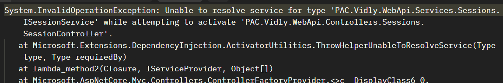
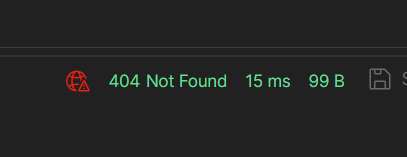
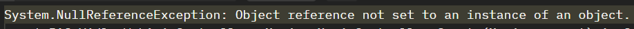

# Prueba de Actuación en clase M5A - AN

Para entregar su trabajo tienen que hacer un **Pull Request** con su **nombre, apellido y numero de estudiante**.

## Consigna

El codigo entregado tiene varios errores, pueden ser de compilacion, de ejcucion, pruebas que fallan, pruebas mal ubicadas, mal diseño de endpoints y codigo faltante para la completitud de funcionalidades. La pruebe consta de arreglar los problemas encontrados, completar las funcionalidades existentes y realizar la implementacion de nuevas funcionalidades.

Deberan de realizar pruebas unitarias para las nuevas funcionalidades y para la modificacion de funcionalidades existentes.

No deben realizar pruebas para aquel codigo que funciona correctamente y fue provisto.

## Correcciones

### Resolver errores de compilacion

### Resolver pruebas que fallan

### Errores de ejecucion

- Cuando se quiere acceder a cualquier endpoint ocurre un error como el siguiente:

<p align="center">

</p>

- No se puede acceder a las peliculas usando el endpoint `movies` ocurre el siguiente error:

<p align="center">

</p>

- Se quiere usar el endpoint `POST sessions` para la autenticacion pero ocurre el siguiente error:
<p align="center">

</p>

### Bugs crear pelicula

- Se pueden crear peliculas con un id seteado desde el cliente
- Se puede setear el dueño de la pelicula diferente al usuario logueado
- Se pueden crear peliculas con el nombre vacio
- Se pueden crear peliculas duplicadas
- No devuelve el id de la pelicula recien creada

Restricciones a cumplir:

- El usuario creador debe ser el usuario logueado
- El id de las pelicula guardada debe ser la autogenerada en el codigo
- El nombre debe ser unico y debe tener al menos un caracter y maximo 100
- Se debe retornar unicamente el id de la nueva pelicula

### Bug al listar las peliculas

Cuando existen peliculas en el sistema y se usa el endpoint para listar las peliculas, ocurre la siguiente excepcion:

<p align="center">

</p>

## Modificaciones

### Unico perfil de ejecucion

Solo debe existir un perfil de ejecucion llamado `Vidly.WebApi`, dicho perfil debe de correr en el puerto 5000 y cuando se ejecute debe de apuntar al endpoint `health`.

## Implementaciones

### Uso sqlite

Tanto para el uso en ejecucion como para las pruebas, se debe utilizar el proveedor de base de datos SQLite.

El connection string debe ser el siguiente.

```JSON
{
  "ConnectionStrings":{
    "Vidly": "Data Source=vidly.db"
  }
}
```

Una vez ejecutada las migraciones se debera de crear el siguiente archivo `vidly.db` en el directorio `PAC.Vidly.WebApi`

### Seed data

Crear un usuario semilla en el contexto `PacVidlyDbContext`

### Filtro de autenticacion

Todos los endpoints excepto el de login y el de crear usuario, deberan de estar protegidos por un filtro de autenticacion.

### Filtro de excepciones

Se debera de implementar un filtro de excepciones que mapee cualquier excepcion al siguiente mensaje de error:

```JSON
{
  "Code": string,
  "Message": string,
  "DeveloperMessage": string
}
```

<p align="center">
[Estructura del mensaje]
</p>

```JSON
{
  "code": "InternalError",
  "Message": "Ocurrio un error, intente mas tarde.",
  "DeveloperMessage": "ArgumentNullException"
}
```

<p align="center">
[Mensaje de ejemplo]
</p>

Los valores de `Code` y `Message`, deben ser esos, pero el valor de `DeveloperMessage` tiene que ser el mensaje de la excepcion

### Crear usuario

Se desea tener una funcionalidad completa para la creacion de usuario, esto quiere decir, que se tiene que diseñar el endpoint correspondiente hasta impactar en la capa de persistencia. La informacion de un usuario es: nombre, email, password y peliculas favoritas, las peliculas marcadas como favoritas deben de estar cargadas previamente en el sistema y no pueden haber mas de un usuario con el mismo email.

### Obtener pelicula

Dado el identificador de una pelicula se desea obtener el nombre, la cantidad de usuarios que la tienen marcada como favorito y el nombre de esos usuarios.

## Posible mejora

Actualmente la interfaz `IUserService` tiene el metodo `GetByCredentials` la cual retorna el usuario con las credenciales que se le pase en caso de que exista, de lo contrario se retorna una excepcion. Dado que la visibilidad de `IUserService` es `public`, un `controller` que use esta interfaz tiene acceso a dicho metodo. Que principio SOLID usaria para que solo la funcionalidad `GetByCredentials` sea utilizada por clases `servicios`.

[Responder aca]

